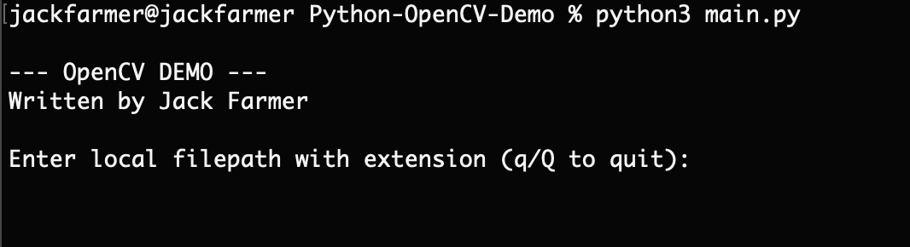

# Python OpenCV Demo

## About

This is a demonstration utilizing the OpenCV API for Python3 by Jack Farmer.
This demonstration was made for CPSC 501 at Christopher Newport University

This demo takes a filepath to a [.png, .jpeg, or .jpg] filetype and runs a face detection model against an image to detect if a face is present, anf if so outline it. The demo will distinguish the original image from the modified with additional text, and outputs the original and modified images in a separate window for comparison.

## Requirements

This demo requires the following to run properly:
- Python 3.8 or better
- OpenCV for Python
- pip3
- Numpy

All of the above should already be included in the provided Python environment.

## Setup

Setup is easy! Simply run the `setup.sh` script with your terminal by running:
```bash
cd <path to this repo>
bash setup.sh
```
> **_NOTE_**: Please verify that you have installed python3 before running this script. If your system does
not currently have python3 installed, please download and install it at [python.org/downloads](https://www.python.org/downloads/)

## How to use

1. Run the following command:
```bash
cd <path to this repo>
python3 main.py
```
2. The user should see the following output 

- 

3. If the file is valid, the program will run as expected 

-  

> **_NOTE_**: in order to close the output window, the user must press any key while actively on the output window, otherwise the image will remain on the screen. This is not an issue on windows, as the user is able to click the 'x' at the top of the window, whereas the option is unavailable on macOS.


## Issue Reporting

If there are any issues or areas of concern with this project, please feel free to submit a report ticket and I will address the issue as quickly as I can.

Thank you for your support!
