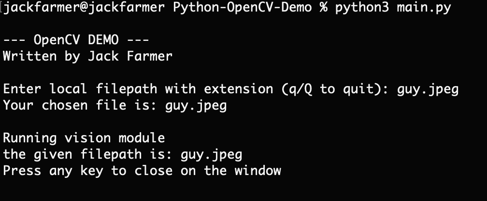

# Python OpenCV Demo

## About

This is a demonstration utilizing the OpenCV API for Python3 by Jack Farmer
This demonstration was made for CPSC 501 at Christopher Newport University

This demo takes a filepath to a .png, .jpeg, or .jpg filetype and runs a number of OpenCV-specific functions to distinguish the original image from the modified. It then outputs the image to a new file saved in this repository.

## Requirements

This demo requires the following to run properly:
- Python 3.8 or better
- OpenCV for Python
- pip3
- Numpy

All of the above should already be included in the provided Python environment.

## How to use

1. In your terminal of choice, `cd` to this directory (this repo)
2. Run the following command:
```bash
python3 main.py
```
3. The user should see the following output 

- 

4. If the file is valid, the program will run as expected 

-  

NOTE: in order to close the output window, the user must press any key while actively on the output window, otherwise the image will remain on the screen.


## Issue Reporting

If there are any issues or areas of concern with this project, please feel free to submit a report ticket and I will address the issue as quickly as I can.

Thank you for your support!
